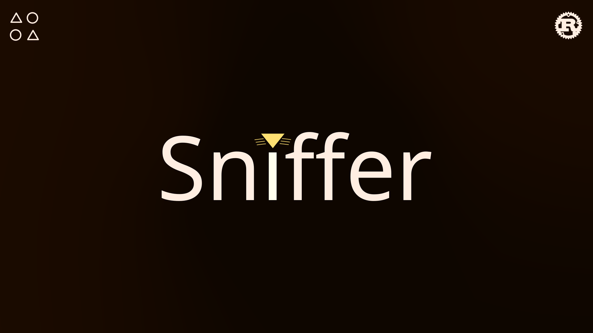

<div align="center">



</div>

# About
Sniffer is a library for fuzzy matching strings in rust. For example ybe is a match for Youtube. This provides a easy and user friendly way to search for a match without the need for a lot of code.

# Install
To install do this in your project:
```sh
cargo add sniffer-rs
```
Or add it manually in cargo.toml:
```toml
[dependencies]
sniffer-rs = "1.0.2"
```

# Usage
The usage of the library is very simple. It provides 4 algorithms for searching and a sniffer object that contains sane defaults for searching.

## Basic match
```rust
let sniffer = Sniffer::new();
let matches = sniffer.matches("banana", "bana");
```

## Case sensitive match
```rust
let sniffer = Sniffer::new().set_case_sensitive(true);
let matches = sniffer.matches("Banana", "banana");
```

## Levenshtein Algorithm
Returns the amount of characters that are different.
```rust
let matches = get_levenshtein_distance("Banana", "banin3");
```

## Hamming Algorithm
Returns the amount of positional characters different. It only works with same size strings.
```rust
let matches = get_hamming_distance("banana", "banin3")
```

## Jaro Winkler Algorithm
Returns the difference in a percentage. From 0.0 to 1.0.
```rust
let matches = get_jaro_winkler_distance("banana", "banan")
```

## Inner Algorithm
Returns true if the characters are inside the string.
```rust
let matches = get_inner_match("Sprigatito", "agt");
```

## Sniffer
The sniffer match object can be changed in its intialization in case you don't like the default values.

```rust
let sniffer = Sniffer().set_levenshtein_distance(2)
                .set_do_levenshtein_match(true)
                .set_hamming_distance(2)
                .set_do_hamming_match(true)
                .set_jaro_winkler_distance(0.8)
                .set_do_jaro_winkler_match(true)
                .set_do_inner_match(true)
                .set_case_sensitive(false);
```

## Sniffer Result
The sniffer result returns the values of the algorithms from a match. It's more appropriate for debuging. 

```rust
let result = get_sniffer_result("Luxray", "lux");
```

# Contributors
The people that are helping the project with minor or big changes.

<a href="https://github.com/whiskers-apps/sniffer-rs/graphs/contributors">
  
</a>
